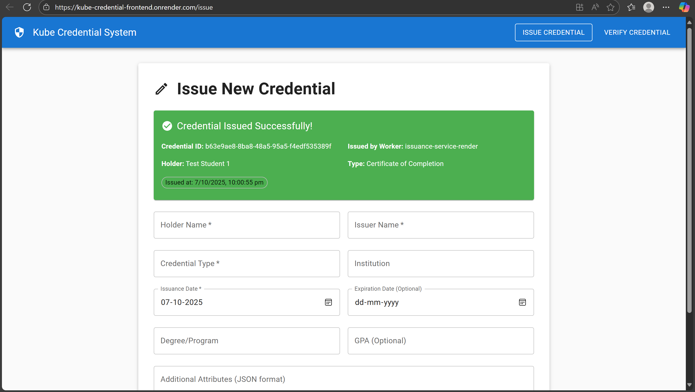
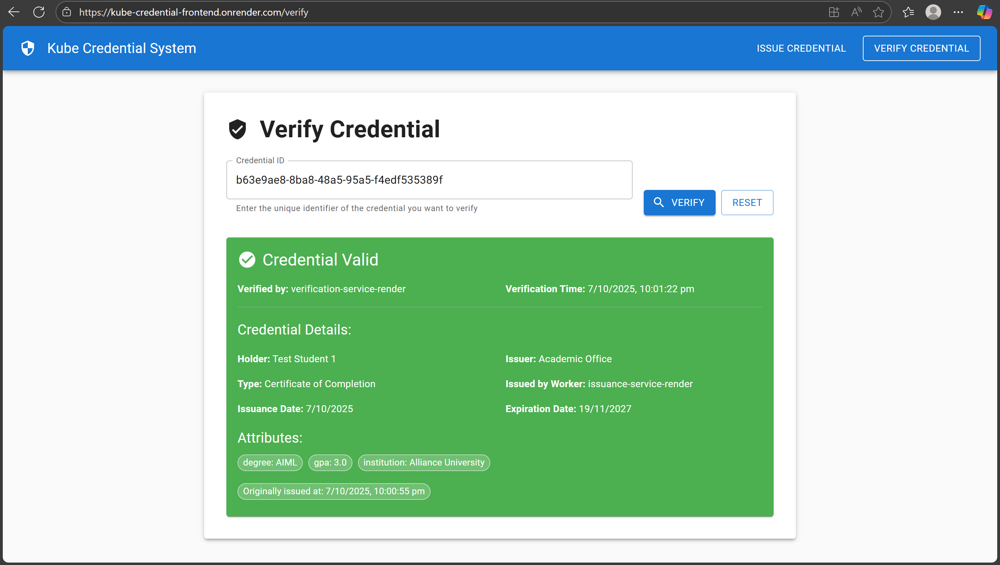

# Kube Credential System

A microservice-based digital credential issuance and verification system.

---
## 🐳 Docker Deployment

### Quick Start with Docker Compose
```bash
# Clone repository
git clone https://github.com/buthuruvenkatareddy/Kubernetes-project.git
cd Kubernetes-project

# Start all services with Docker
docker-compose up -d

# View logs
docker-compose logs -f

# Stop services
docker-compose down
```

### Services in Docker Compose
- **PostgreSQL Database** - Port 5432
- **Issuance Service** - Port 3001
- **Verification Service** - Port 3002
- **Frontend Application** - Port 3000

### Individual Docker Commands
```bash
# Build images
docker build -t kube-issuance ./backend/issuance-service
docker build -t kube-verification ./backend/verification-service
docker build -t kube-frontend ./frontend

# Run containers individually
docker run -p 3001:3001 kube-issuance
docker run -p 3002:3002 kube-verification
docker run -p 3000:3000 kube-frontend
```

## 🧪 Testing

### Unit Tests
```bash
# Test Issuance Service
cd backend/issuance-service
npm test

# Test Verification Service
cd backend/verification-service
npm test

# Test Frontend
cd frontend
npm test
```

### Manual Testing
```bash
# Test service health
curl http://localhost:3001/health  # Issuance service
curl http://localhost:3002/health  # Verification service

# Test credential issuance
curl -X POST http://localhost:3001/api/credentials/issue \
  -H "Content-Type: application/json" \
  -d '{"subject":"test@example.com","issuer":"Test Org","credentialType":"TestCred","claims":{"name":"Test User"}}'
```

### Test Coverage
- API endpoint testing
- Database operation testing
- Input validation testing
- Service communication testing
- Error handling testing

## 💻 Local Development

### Prerequisites
- Node.js 18+
- PostgreSQL 12+
- Docker (optional)

### Manual Setup
```bash
# Install dependencies
cd backend/issuance-service && npm install
cd ../verification-service && npm install
cd ../../frontend && npm install

# Start services
npm run dev  # In each service directory
```er Information

**Name:** Buthuru Venkat Reddy  
**Email:** buthuruvenkatreddy@gmail.com  
**Phone:** +91 6302561651  
**GitHub:** https://github.com/buthuruvenkatareddy

---

##  Live Application

### ⚠️ Important: Wake Up Services First

Render.com free tier services sleep after 15 minutes. You MUST wake up backend services first:

1. **Issuance Service:** https://kube-credential-issuance.onrender.com/
   - Click and wait 30-60 seconds

2. **Verification Service:** https://kube-credential-verification.onrender.com/
   - Click and wait 30-60 seconds

3. **Frontend:** https://kube-credential-frontend.onrender.com/
   - Use ONLY after backend services are awake

---

##  Project Overview

This system allows organizations to:
- **Issue Digital Credentials** - Create verifiable credentials
- **Verify Credentials** - Check credential authenticity
- **Manage Data** - Store credential information securely

### Components
- **Issuance Service** - Issues credentials, stores in PostgreSQL
- **Verification Service** - Verifies credentials
- **React Frontend** - Web interface

---

##  System Flow

```
User → React Frontend → Backend Services → PostgreSQL Database
```

### Credential Issuance Flow
```
User fills form → Frontend → Issuance Service → Database → Success Response
```

### Credential Verification Flow
```
User enters ID → Frontend → Verification Service → Issuance Service → Database → Result
```

---

##  Technology Stack

- **Backend:** Node.js + TypeScript + Express.js
- **Database:** PostgreSQL
- **Frontend:** React + TypeScript + Material-UI
- **Deployment:** Render.com
- **Containerization:** Docker

---

##  Project Structure

```
kube-credential/
├── backend/
│   ├── issuance-service/
│   └── verification-service/
├── frontend/
├── Kube_Screenshots/
│   ├── 1.png    # Issuance service output
│   └── 2.png    # Verification service output
└── docker-compose.yml
```

---

##  Screenshots

### Issuance Service Output


### Verification Service Output


---

##  Features

- Issue digital credentials with unique IDs
- Verify credential authenticity
- PostgreSQL database storage
- Responsive web interface
- RESTful API design
- Docker containerization

---

##  Quick Start

```bash
# Clone repository
git clone https://github.com/buthuruvenkatareddy/Kubernetes-project.git

# Start with Docker
docker-compose up -d

# Access frontend
http://localhost:3000
```

---

##  Contact

**Developer:** Buthuru Venkat Reddy  
**Email:** buthuruvenkatreddy@gmail.com  
**Phone:** +91 6302561651  
**Repository:** https://github.com/buthuruvenkatareddy/Kubernetes-project

---
